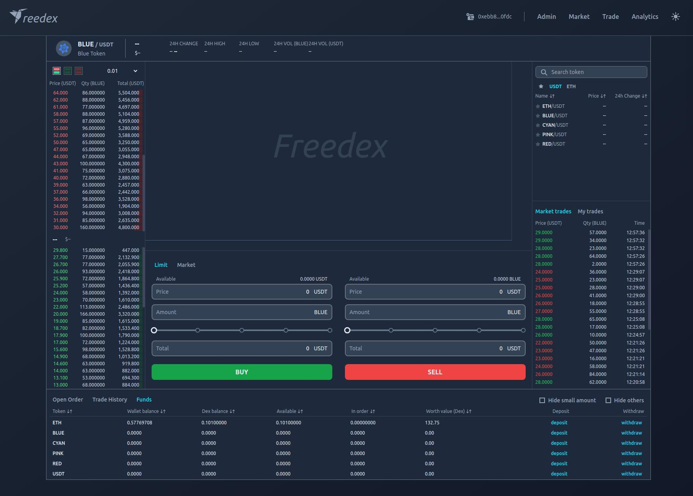

# Dex UI
This frontend is trying to achieve the trading UI of prevailing cryptocurrency exchanges. 

#### Functionalities supported:
- assets deposit/withdraw
- order place/cancel
- order book view
- trade history view
- assets view
- market view

#### Functionalities not finished:
- trade history graph (most exchanges have Tradingview plugin embedded)
- Token Analytics (mainly statistics presentation, such as correlation heatmap, portfolio sharpe ratio, etc.)

#### Demo site at https://sunny-brioche-eb6cdd.netlify.app

Wallet plugin ([Metamask](https://metamask.io/)) is required to interact with the backend contract.  
As the data are retrieved directly from on-chain Ethereum testnet ([**Goerli**](https://goerli.net/) or [**Arbitrum Goerli**](https://docs.arbiscan.io/v/goerli-arbiscan)), there will be some delays depending on network connection quality

#### The following lists one of the test accounts, with a bunch of buy orders on BLUE/USDT pair book
<em>
Account: 0xE1FA54B09b0ab21d7023c1D748742e8662c1a973 
Private Key: 0x239fc65b7eb64de2163897b7d56d56dba31d5a5fac3725ffe756095fcbc16027
</em>
